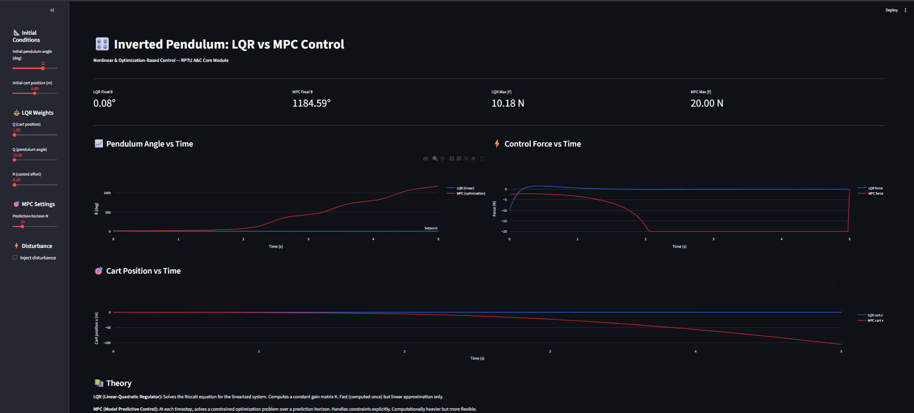
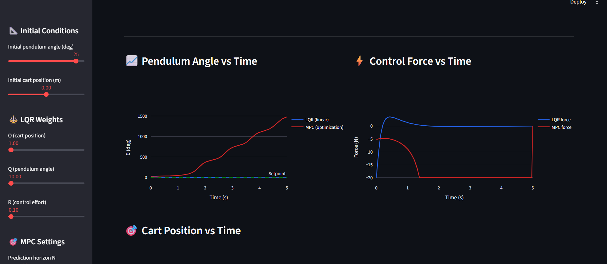
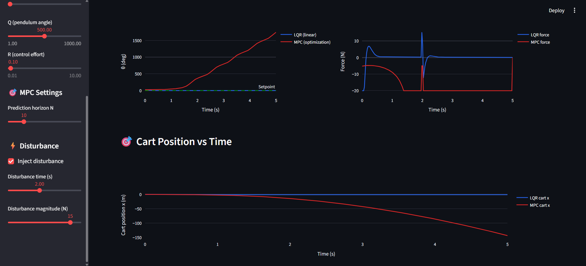

# 🎛️ Nonlinear Control & MPC Simulator
 

 
## Overview
Inverted pendulum simulator comparing LQR (linear-quadratic regulator)
and MPC (Model Predictive Control). Demonstrates nonlinear control
and optimization-based control concepts.
 
## 🔗 Live Demo
**[Open Simulator](https://your-url.streamlit.app)**
 
## Features
- Full nonlinear pendulum-on-cart dynamics
- LQR controller via Riccati equation (scipy.linalg.solve_continuous_are)
- MPC controller via SLSQP optimization (scipy.optimize.minimize)
- Disturbance injection with recovery analysis
- Tunable Q, R weights for LQR
- Adjustable prediction horizon for MPC
 
## Test Scenarios
### Large Initial Angle (Nonlinear)

 
### Disturbance Rejection

 
## Theory
**LQR:** Solves continuous-time algebraic Riccati equation. Constant
feedback gain. Optimal for linear systems with quadratic cost.
 
**MPC:** Solves constrained QP at each timestep over prediction horizon.
Handles input constraints, nonlinearity, multivariable systems.
 
## Relevance to RPTU A&C
- Core module: "advanced methods for nonlinear and adaptive control"
- Core module: "optimization-based control"
- Foundation for the Real-Time Control Systems (RCS) major
 
## Tools
Python, Streamlit, Plotly, SciPy, NumPy
 
## Author
**Oscar V. Dbritto** 
